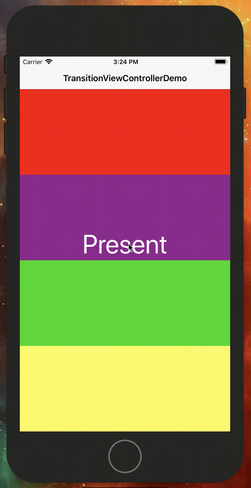
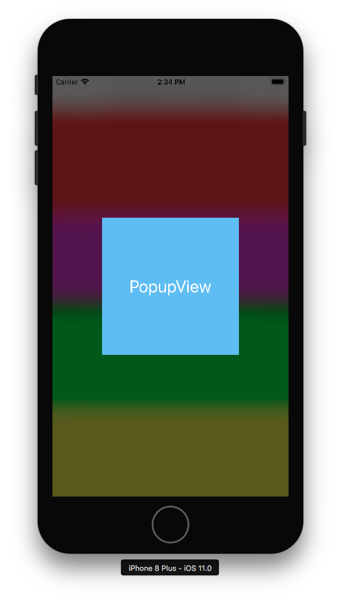
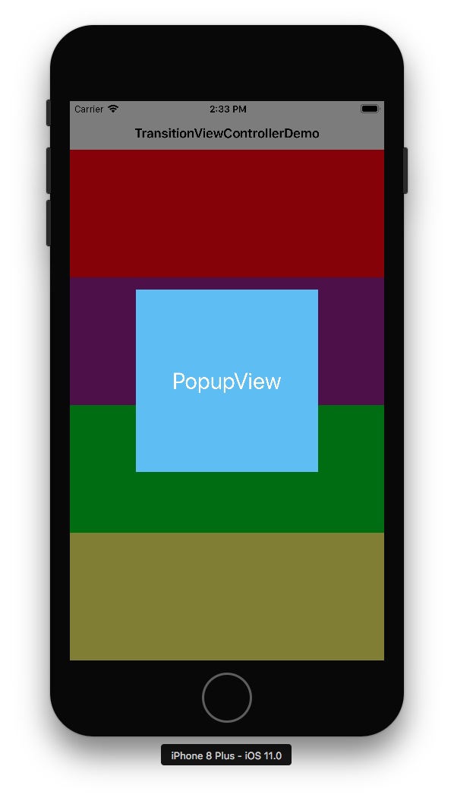

# TransitionViewController

[](https://travis-ci.org/gliyao/TransitionViewController)
[](https://opensource.org/licenses/MIT)

Use blur transiton effect in 2 steps. 

First, subclass your dialog view controller.
Second, chose tranistion style you want.

</img>


## Support Xib
You can easily subclass `TransitionViewController` to achieve blur background effect.


## Background effet

There have 2 kind of background effect. Blur and black with alpha.

</img>
</img>

``` swift
enum TransitionStyle {
	case black(CGFloat)
	case blur(UIBlurEffectStyle)
}
```

## Present and dismiss direction

Support 4 direction (top, bottom, left, right)

``` swift
enum TransitionPosition {
	case top, bottom, left, right
}
```

## Sample code

``` swift
// 1. Subclass for your dialog view controller
class YourPopupViewController: TransitionViewController {
	override init(nibName nibNameOrNil: String?, bundle nibBundleOrNil: Bundle?) {
		super.init(nibName: nibNameOrNil, bundle: nibBundleOrNil)
		
		// 2. Change transition here!!
		self.transition = TransitionAnimator(style: .blur(.light), presentFrom: .bottom, dismissTo: .bottom)
	}

	required init?(coder aDecoder: NSCoder) {
		fatalError("init(coder:) has not been implemented")
	}
}
```
