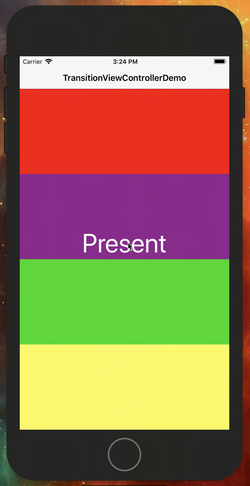

# TransitionViewController

[](https://travis-ci.org/gliyao/TransitionViewController) 
[](http://cocoapods.org/pods/TransitionViewController)
[](http://cocoapods.org/pods/TransitionViewController)
[](http://cocoapods.org/pods/TransitionViewController)
[](https://codecov.io/gh/gliyao/TransitionViewController)
[](https://www.apple.com/tw/ios)&nbsp;

Use blur transiton effect in 2 steps. 

First, subclass your dialog view controller.
Second, chose tranistion style you want.

</img>

## Support Xib
You can easily subclass `TransitionViewController` to achieve blur background effect.


## Background Effet

There have 2 kind of background effect. Blur and black with alpha.

</img>
</img>

``` swift
enum TransitionStyle {
	case black(CGFloat)
	case blur(UIBlurEffectStyle)
}
```

## Present and Dismiss Direction

Support 4 direction (top, bottom, left, right, none)

``` swift
enum TransitionPosition {
	case top, bottom, left, right, none
}
```

## How To Use

``` swift
// 1. Subclass for your dialog view controller
class YourPopupViewController: TransitionViewController {
	override init(nibName nibNameOrNil: String?, bundle nibBundleOrNil: Bundle?) {
		super.init(nibName: nibNameOrNil, bundle: nibBundleOrNil)
		
		// 2. Change transition here!!
		self.transition = TransitionAnimator(style: .blur(.light), presentFrom: .bottom, dismissTo: .bottom)
	}

	required init?(coder aDecoder: NSCoder) {
		fatalError("init(coder:) has not been implemented")
	}
}
```

## Requirements

- iOS 8.0 or later

## Installation

TransitionViewController is available through [CocoaPods](http://cocoapods.org). To install
it, simply add the following line to your Podfile:

```ruby
pod 'TransitionViewController'
```

## Author

Liyao Chen, gliyao@gmail.com

## License

TransitionViewController is available under the MIT license. See the LICENSE file for more info.

